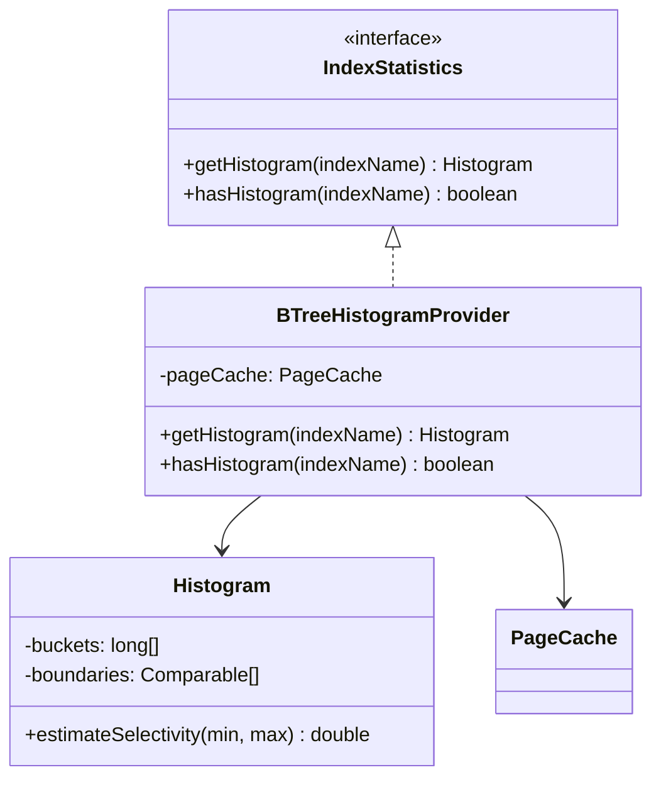
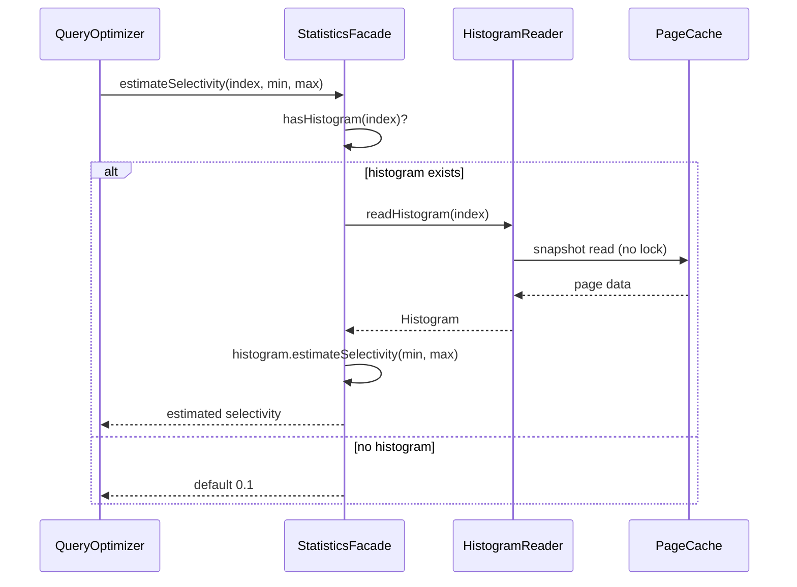

# Design Document Rules

<!--Document index start-->

| Section | Roles | Phases | Summary |
|---|---|---|---|
| §Purpose | planner,final-designer,reviewer-design | 1,4 | Why the design doc exists and what it must convey. |
| §Boundary with the implementation plan | planner,final-designer | 1,4 | What belongs in the design doc versus the plan. |
| §Mutation discipline: every change is one atomic action | planner,final-designer,reviewer-design | 1,4 | Each design-doc change is one apply-review-iterate action. |
| §The atomic action | planner,final-designer,reviewer-design | 1,4 | The four-step shape of a single design mutation. |
| §Cold-read scope by mutation kind | reviewer-design | 1,4 | How much of the doc the cold-read reviewer reads per mutation kind. |
| §Mechanical checks (always run) | planner,final-designer,reviewer-design | 1,4 | Automated structural checks every mutation triggers. |
| §Findings and severities | reviewer-design | 1,4 | How cold-read findings are graded and reported. |
| §Review log | planner,final-designer | 1,4 | Append-only log recording each mutation and its review. |
| §Cold-read sub-agent prompt | planner,reviewer-design | 1,4 | Prompt template for the design cold-read reviewer. |
| §Two-mode editing — working vs sync | planner,final-designer | 1,4 | The working-draft mode versus the sync-to-final mode. |
| §Direct mutation (existing kinds) | planner,final-designer | 1,4 | Applying a mutation of an already-defined kind directly. |
| §Working / sync (the iterative model) | planner,final-designer | 1,4 | The iterative working-then-sync editing model. |
| §Overview (mandatory, first content) | planner,final-designer | 1,4 | The mandatory concept-first Overview section. |
| §Core Concepts (mandatory when applicable) | planner,final-designer | 1,4 | The Core Concepts section and when it is required. |
| §Per-section mandatory shape | planner,final-designer | 1,4 | Required internal shape of each design section. |
| §Top-level structure caps | planner,final-designer | 1,4 | Caps on section count and depth at the top level. |
| §Consolidation form for sibling sections | planner,final-designer | 1,4 | Collapsing repetitive sibling sections into one consolidated form. |
| §Length-triggered split into `design-mechanics.md` | planner,final-designer | 1,4 | When the doc grows past the trigger and splits off the mechanics file. |
| §D/S code discipline | planner,final-designer | 1,4 | Conventions for D-code decision records and S-code structures. |
| §Section naming stability | planner,final-designer | 1,4 | Keeping section names stable so cross-references survive edits. |
| §Required content | planner,final-designer | 1,4 | Content every design doc must contain. |
| §Rules | planner,final-designer | 1,4 | The consolidated rule list for design-doc authoring. |
| §Structure | planner,final-designer | 1,4 | The canonical top-level section order. |

<!--Document index end-->

The plan must be accompanied by a separate **design document** at
`docs/adr/<dir-name>/_workflow/design.md` that explains **what will be
implemented at a design level** — not code, but the structural and
behavioral design of the solution. (Phase 4 promotes the post-implementation
view of this design to the durable `docs/adr/<dir-name>/design-final.md`;
the working `_workflow/` copy is removed in the Phase 4 cleanup commit.)

## Purpose
<!-- roles=planner,final-designer,reviewer-design phases=1,4 summary="Why the design doc exists and what it must convey." -->

- Bridge the gap between high-level architecture (Component Map, Decision Records)
  and track-level execution details
- Make complex or non-obvious parts of the implementation explicit so the execution
  agent and reviewers can verify intent without reverse-engineering code
- Provide a single place where the overall design can be understood as a coherent
  whole, not just as a collection of tracks
- Hold the **long-form** material that supports plan-level decisions
  (worked examples, layered diagrams, multi-paragraph rationale,
  crash-scenario walk-throughs) so the implementation plan can stay
  thin and strategic — see "Boundary with the implementation plan"
  below.

## Boundary with the implementation plan
<!-- roles=planner,final-designer phases=1,4 summary="What belongs in the design doc versus the plan." -->

The plan corpus is split across files with a strict content
boundary. Putting prose in the wrong file inflates the
`/execute-tracks` startup load (the plan file is read at every
session) and routinely produces duplication between the plan and the
design document.

| File | What it carries |
|---|---|
| `implementation-plan.md` | Goals, constraints, the **decisions themselves** (alternatives / rationale / risks / where-implemented / link-to-design), the Component Map (topology + short intent bullets), short invariant statements, short integration-point bullets, the track checklist. **Strategic, scannable, loaded every session.** |
| `design.md` | Concept-first Overview; Core Concepts (when applicable); class diagrams; sequence/flow diagrams; **TL;DR-shaped** entries for every complex topic; condensed mechanism overview; edge-case bullets; decisions-and-invariants footer (the D11 rename of the former references footer). **In `full`-tier plans only; the frozen seed for the carriers. Loaded only when referenced; serves both human reviewers and execution agents.** |
| `design-mechanics.md` (optional, length-triggered) | Long-form derivations, file:line citations, edit-list subsections, full state-machine tables, exhaustive worked examples that don't fit in `design.md`'s mechanism overview. **Created only when `design.md` exceeds the length trigger; cross-referenced from `design.md`'s decisions-and-invariants footer (the `Mechanics:` line).** |
| `plan/track-N.md` `## Purpose / Big Picture` | Per-track intro paragraph that names the track, its BLUF outcome, and the ADDED/MODIFIED/REMOVED triad (sibling Move 2 reserved slot). Track-level concrete deliverables and edit detail belong here together with the three sections below. |
| `plan/track-N.md` `## Context and Orientation` | Per-track static context: the files, classes, methods, and subsystems the track touches; ordering constraints relative to other tracks; pre-existing invariants the track must respect. |
| `plan/track-N.md` `## Plan of Work` | Per-track approach prose: how the track delivers its outcome at a step-shape level (not per-step detail — that lives under `## Concrete Steps`). Any track-level Mermaid diagram lives here. |
| `plan/track-N.md` `## Interfaces and Dependencies` | Per-track cross-track interactions: which other tracks this track depends on or unblocks, which shared interfaces it touches, and any sibling-Move slot reservations. |

**All four `plan/track-N.md` rows above:** per-track edit detail;
written by `create-plan` at Phase 1; loaded only in Phase A of one
track per session (and by Phase 2 reviews of pending tracks).

> **The rule, succinctly:** if you find yourself writing a worked
> example, a multi-paragraph derivation, a code-change inventory, or
> a "here is how all the pieces fit together" walk-through inside a
> decision record, an invariant, or an integration-point bullet,
> **stop and move it to `design.md`** (or, if it is per-track edit
> detail, to that track's `plan/track-N.md` under whichever of
> `## Purpose / Big Picture`, `## Context and Orientation`,
> `## Plan of Work`, or `## Interfaces and Dependencies` best fits
> the content). Replace the original location with a one-line link.

The reciprocal pointer is the `**Full design**: design.md §<section>`
line in the Decision Record template (see `planning.md` § Decision
Records). When a DR has long-form support, the DR itself stays at the
four-bullet form and the long-form material lives in `design.md` under
a section the DR links to.

**The seed-vs-carrier boundary (D11, YTDB-1083 acceptance #4
rewrite).** In `full`, `design.md` is the **frozen seed**: it holds
each decision's full record once (the introduce-once rule, § Per-section
mandatory shape), and Step 4b seeds the **track-canonical live records**
(each relevant track's `## Decision Log`, D7 / YTDB-814) from those seed
D-records. The seed is provenance, never the live authority — once a
track absorbs a record it is authoritative, and the frozen seed cannot
follow a Phase-3 replan. In `lite`/`minimal` there is no `design.md`;
Step 4b authoring reads the **research log** directly as the seed for
the track records (S2: the log is read for decision content only at
Step 4a/4b authoring and the Phase-2 consistency cross-check). This
rewrites YTDB-1083's original acceptance #4 — which framed the log as a
transient bridge folded into the design and deleted before freeze: under
D5 the log is a durable Phase-0/1 ledger removed only at Phase 4
cleanup, and it is a Phase-2 cross-check input, never a Step-4b seeding
input in `full` (where the frozen seed is the seeding source).

**What this looks like in practice:**

- A decision whose rationale is "we picked B over A because A doesn't
  satisfy invariant X" — that's a 1-line rationale, no `design.md`
  section needed.
- A decision whose rationale needs a worked example (e.g., walking
  through what happens to a transaction when the rollback log is
  evicted mid-commit) — keep the four-bullet rationale at one
  sentence, then add a `design.md` section titled "Rollback log
  eviction during commit" that walks the example, and link to it from
  the DR's `**Full design**` line.
- An invariant like "WAL atomic operation boundaries enclose the
  histogram update" — one bullet, no `design.md` section needed.
- An invariant whose semantics need a multi-paragraph derivation
  (e.g., why the read path is safe under concurrent eviction) — keep
  the invariant entry at one bullet stating the rule, and add a
  `design.md` complex-topic section that derives it.

## Mutation discipline: every change is one atomic action
<!-- roles=planner,final-designer,reviewer-design phases=1,4 summary="Each design-doc change is one apply-review-iterate action." -->

**Every modification to `design.md`** (and `design-mechanics.md`
when it exists) **is implemented as one atomic action that
internally bundles `(apply edit → auto-review → bounded iterate
→ present)`. The agent never directly Edits these files mid-
conversation; it invokes the mutation action, which wraps the
review gate.**

The discipline applies to every situation that touches the
design:

- Initial creation in Phase 1 (`phase1-creation`)
- Interactive iteration during Phase 1 (`mechanics-edit`,
  `design-sync`)
- Phase 4 production of `design-final.md` /
  `design-mechanics-final.md` (`phase4-creation`)

The design document is frozen after Phase 1 (Rule 15): Phase 3
inline replanning never mutates it. A replan that would have
revised the design records its intent in the plan's Decision
Records and the track narrative instead — see
inline-replanning.md:orchestrator:3A,3C § Process and
implementer-rules.md:implementer:3B,3C § Loading discipline.

The same gate fires every time. Without this discipline, the
shape rules in the rest of this document are aspirational —
they catch failure modes only if someone or something runs the
check. Bundling the review with the write makes the rules
self-enforcing.

### The atomic action
<!-- roles=planner,final-designer,reviewer-design phases=1,4 summary="The four-step shape of a single design mutation." -->

Each mutation invocation receives:

- The intended edit (the diff, or the full new section content)
- The mutation kind, drawn from the full set of 11:
  - **Direct mutation kinds** (existing-doc edits, full discipline runs
    on every mutation): `content-edit`, `section-add`, `section-remove`,
    `section-rename`, `section-move`, `structural-rewrite`,
    `length-trigger-crossing`.
  - **Working/sync kinds** (Phase 1 iteration loop, deferred cold-read on
    mechanics): `phase1-creation`, `mechanics-edit`, `design-sync`.
  - **Phase 4 kind** (one-shot creation of the committed final artifact):
    `phase4-creation`.

  See the cold-read scope table below for the per-kind discipline; the
  full lifecycle for the working/sync kinds lives in § Two-mode editing —
  working vs sync.
- An iteration budget (default: 3 rounds)

The action runs:

1. **Apply edit.** Write the change to disk.
2. **Auto-review.** Mechanical checks, then cold-read:
   - **Mechanical checks** — cheap, always run. See checks
     table below.
   - **Cold-read** — sub-agent reads the doc fresh, no prior
     context. Scope depends on mutation kind (see scope table
     below). For `phase1-creation` the cold-read is **gated**
     behind the relocated log-adversarial gate (D6): the
     decision/assumption challenge runs once on the research log
     at the Phase 0 → 1 boundary, and the cold-read may not run
     while a log-adversarial entry is open (the S3 freeze-order
     invariant). See § Working / sync for the gated-cold-read
     ordering. No mutation kind runs a local adversarial pass.
3. **Iterate.** If review finds blockers, attempt to fix and
   re-review. Bounded by the iteration budget. If the budget
   exhausts with blockers remaining, present findings + diff
   to the user for manual resolution rather than continuing
   to iterate.
4. **Present.** Show the user the resulting diff + the
   auto-review log. The action is complete.

The user never invokes the mechanical checks or the cold-read
directly; they invoke the mutation action and receive the
final state.

**Concrete invocation.** The design-doc mutation action is
implemented as the `edit-design` skill at
edit-design/SKILL.md:final-designer,orchestrator,planner:1,4.
The mechanical checks half is the script at
[`.profile-b/scripts/design-mechanical-checks.py`](../../.profile-b/scripts/design-mechanical-checks.py).
The cold-read half is the sub-agent prompt at
prompts/design-review.md:reviewer-design:1,4. When the
agent needs to modify `design.md` or `design-mechanics.md`, it
invokes the skill — not raw `Edit` / `Write`.

**Scope: new mutations only.** The discipline gates *new*
modifications to a design document. Existing `design.md` files that
predate the discipline (or were created before a particular rule was
added) may have legitimate findings if you point the script at them
out of curiosity — that's expected and not a bug. The contract is
"every mutation lands without introducing or worsening findings,"
not "every existing file passes today." Backfilling old designs is a
separate exercise and is not required.

### Cold-read scope by mutation kind
<!-- roles=reviewer-design phases=1,4 summary="How much of the doc the cold-read reviewer reads per mutation kind." -->

In the table below, the `--target` column reads as a function of whether a
`design-mechanics.md` companion exists. "`design.md` only" designs use
`--target=design`; designs that also touch mechanics (because the seeding
or rename or rewrite spans both files) use `--target=both`. Mutation kinds
whose `--target` depends on this condition are written as
`design \| both` and resolved by the `edit-design` skill at invocation
time.

| Mutation kind | Touches | Mechanical `--target` | Cold-read scope |
|---|---|---|---|
| `phase1-creation` (initial seed) | `design.md` only when mechanics is not needed; both files when the design will exceed the length trigger or already plans for a mechanics companion | `design \| both` | **Whole-doc** on `design.md` (mechanics is exempt — it's agent-targeted long-form) |
| `mechanics-edit` (working-mode edit) | mechanics only | `mechanics` | **NONE** — cold-read deferred to next `design-sync` |
| `design-sync` (re-distill `design.md` from current mechanics) | both files | `both` | **Whole-doc** on `design.md`, plus mechanics-link sweep |
| `content-edit` within an existing section | `design.md` | `design` | **Bounded** — changed section + 1-2 surrounding sections + Overview + (when present) Core Concepts |
| `section-add` | `design.md` | `design` | **Bounded** — new section + Overview + (when present) Core Concepts + structure roadmap (for placement check) |
| `section-remove` | `design.md` (+ plan / track-file ref cleanup) | `design` | **Whole-doc** — verify no broken references and no orphaned forward-pointers |
| `section-rename` | `design.md` + (when mechanics exists) the matching section in `design-mechanics.md` + plan / track-file ref propagation | `design \| both` | **Whole-doc** — every cross-reference to the renamed section must be updated, including the matching mechanics heading and every `**Full design**` ref in the plan and in every track file |
| `section-move` | `design.md` | `design` | **Whole-doc** — verify the new placement makes sense in the reader journey |
| `structural-rewrite` (multiple section adds/moves/renames) | `design.md` + (when mechanics exists and any rename or split propagates) the matching sections in `design-mechanics.md` | `design \| both` | **Whole-doc** |
| `length-trigger-crossing` (file crosses the 2,000-line / 50,000-token trigger) | both files | `both` | **Whole-doc** — verify split into `design-mechanics.md` is correctly applied |
| `phase4-creation` (Phase 4 production of `design-final.md` ± `design-mechanics-final.md`) | `design-final.md` + (optional) `design-mechanics-final.md` | `both` if mechanics-final exists, else `design` | **Whole-doc** on `design-final.md`. Plan / track-file ref propagation is **N/A** — Phase 4 produces a *new* committed artifact whose section structure may differ from the original `design.md`; the plan and track files' `**Full design**` refs continue to point at the original (frozen) `design.md`, not at the final variant. The skill omits `--plan-path` / `--plan-dir` so the cross-file ref check is naturally skipped. |

**Periodic whole-doc check.** Every Nth design-touching mutation
(default N=5, counted from the review log) triggers a whole-doc
cold-read regardless of the kind, to catch coherence drift across
many small edits. `mechanics-edit` mutations do **not** increment
this counter.

**Two distinct counters.** Both fire at "5", but they count
different things and trigger different actions. A small table to
keep them apart:

| Counter | Counts | Resets on | Triggers |
|---|---|---|---|
| Periodic whole-doc counter | All mutation log entries except `mechanics-edit` | Never resets — it's a running modulo over the log | Cold-read scope is escalated to `whole-doc` for the current mutation, regardless of its declared scope |
| Working-mode counter | `mechanics-edit` entries since the most recent `design-sync` (or since `phase1-creation` if no sync has happened yet) | Resets to 0 on every `design-sync` | The skill surfaces *"5 mechanics edits have accumulated since the last sync — want me to run `design-sync`?"* at the next conversational turn |

Both default to N=5 today; if that turns out to be confusing in
practice, change one of the two thresholds rather than relying on
context to disambiguate.

### Mechanical checks (always run)
<!-- roles=planner,final-designer,reviewer-design phases=1,4 summary="Automated structural checks every mutation triggers." -->

| Check | Detection |
|---|---|
| Overview first | First `## ` heading must be `## Overview` (concept-first ordering — meta-navigation is folded into Overview's tail, not given its own header). Body must be ≥ 5 non-empty lines (covers all five required elements: baseline / change / enabling primitive / restructured / roadmap) and ≤ 40 lines total (past 40 the Overview has stopped being an elevator pitch). Both severity `should-fix`. |
| Core Concepts when applicable | If the doc has `# Part N` headings, a `## Core Concepts` section must exist at the top level (not nested inside a Part) between Overview and Class Design (`should-fix` if absent). When present, position is also checked: Core Concepts must come AFTER Overview, BEFORE Class Design, and BEFORE the first `# Part N` heading — concepts must be defined before the deep dives that use them. |
| Per-section shape compliance | Per `^## ` section (excluding shape-exempt: Overview, Core Concepts, Class Design, Workflow, Part-level TL;DR): TL;DR present (`\*\*TL;DR\.\*\*` or similar bold-prefix paragraph in the first ~10 lines); decisions-and-invariants footer present near section end. The footer name accepts **both** spellings (`### Decisions & invariants` or `### References`, and the bold-prefix `\*\*Decisions & invariants\.\*\*` / `\*\*References\.\*\*` forms) so the rename (D11) is backward-compatible — legacy designs carrying `### References` still pass (see § Per-section mandatory shape). |
| Top-level cap | Flat count of `^## ` ≤ 15 always; when `# Part N` headings exist, an additional per-Part cap of ≤ 8 sections (warn at > 6) applies on top of the flat 15 |
| Per-section length cap | Each `^## ` section ≤ 300 lines, three-tier severity: 201-300 lines is a `suggestion` (warn — long-form material is creeping in); 301-400 is `should-fix` (over the soft cap); >400 is a `blocker` (sections over 400 lines almost always have long-form material that must move to `design-mechanics.md`). Honors `--scope=bounded`: when bounded, only the changed section is checked — pre-existing legacy oversize sections are not backfilled. |
| D/S parenthetical asides | Regex set: `(per D…)`, `(per S…)`, `(see D…)`, `(see S…)`, each with optional comma- or slash-separated additional codes (`(per D1, D2)`, `(see S5/S6)`). Rejected inside prose; allowed inside the decisions-and-invariants footer (`### Decisions & invariants` / `**Decisions & invariants.**` or the legacy `### References` / `**References.**`) blocks and table rows. Honors `--scope=bounded` on the `design.md` side: only asides whose line falls within the changed section's range are flagged. (Mechanics-side asides, when `--target=mechanics` or `--target=both`, always run whole-doc — `--changed-section` describes a `design.md` section, not a mechanics section.) |
| Decision cited without rationale (D11, `design.md`-only) | Within each `^## ` section's decisions-and-invariants footer, a `D<n>` listed under `D-records:` must have its full record introduced **once** somewhere in `design.md` (the introduce-once rule, § Per-section mandatory shape). A footer that cites `D<n>` whose full record appears in no section is a `should-fix`: the seed references a decision it never states. The check is **`design.md`-only** — it never runs against track files (they carry records in `## Decision Log`, have no footer) or mechanics. Scoped so the legacy bare-`D<n>` `### References` footer of a pre-rename design does not trip it (a citation whose record exists elsewhere in the same `design.md` passes regardless of footer spelling). |
| `dsc-ai-tell` AI-tell detection | Detects eleven `house-style.md` patterns whose textual fingerprint is reliable enough to flag mechanically: Tier-1 vocabulary base words (`§ Tier 1`), negative parallelism `not X, but Y` constructions (`§ Banned sentence patterns`), em-dash density at 3+ per paragraph or 2 unpaired em dashes carrying a sentence terminator in the middle segment (`§ Em-dash discipline`), Title Case H2+ headings (`§ Title Case headings forbidden` — `# `-level headings are skipped because they are document titles), signposting openers (`§ Signposting`), copula-led sentences in the documented shape (`§ Copula avoidance`), persuasive authority tropes (`§ Persuasive authority tropes`), hyphenated-pair clusters at 3+ within a paragraph (`§ Hyphenated word-pair overuse`), fragmented-header chains (`§ Fragmented headers`), the trailing-negation "X, not just Y" inversion of negative parallelism that the emphatic `not just` / `not merely` / `not simply` intensifier distinguishes from a genuine plain contrast (`§ Banned sentence patterns`), and inflated-abstraction labels in the subject slot ("The enabling primitive is …", "The key abstraction …"; the `## Overview` section is skipped because naming "the enabling primitive(s)" is the prescribed Overview element there) (`§ Banned analysis patterns`). Each finding cites `house-style.md § <Section>` in its description so the reader can trace the rule back to its prose. The check is `auto_applicable: false` — every finding requires a human rewrite. Honors `--scope=bounded` on the `design.md` side in parallel with the D/S parenthetical asides row above: only paragraphs whose line falls within the changed section's range are flagged. |
| Length trigger compliance | If file > 2,000 lines and `design-mechanics.md` doesn't exist, blocker |
| Same-shape sibling detection | Cluster of 3+ sibling `## ` sections with ≥80% Jaccard overlap on custom sub-headings → flag for consolidation. Pairs above the threshold are merged via union-find so a near-duplicate cluster (e.g. 5 sections sharing `### Inputs / ### Algorithm / ### Outputs` plus one with an extra `### Edge Cases`) flags as a single same-shape group. |
| `Mechanics:` / mechanics-link resolution | Every `design-mechanics.md §"<name>"` reference appearing in `design.md` resolves to a real heading in `design-mechanics.md`. The check is applied to all such references — the canonical home for these is the per-section `Mechanics:` line in the decisions-and-invariants footer (either footer spelling), but the script flags any unresolved reference regardless of how the line is prefixed. |
| `**Full design**` link resolution | Every `**Full design**: design.md §"<name>"` in `implementation-plan.md` and in every track file under `plan/` resolves to a real section in `design.md` (and any chained `design-mechanics.md §"<name>"` resolves in mechanics). This is also the check that catches stale references after a rename — when a `section-rename` (or rename inside `structural-rewrite`) has not propagated, the un-updated `**Full design**` and `Mechanics:` lines simply fail to resolve here, blocking the mutation. |

### Findings and severities
<!-- roles=reviewer-design phases=1,4 summary="How cold-read findings are graded and reported." -->

- **blocker** — the mutation cannot stand. The iteration budget
  is consumed attempting to fix; if the budget exhausts with the
  blocker remaining, the action presents the diff + findings to
  the user and stops without "succeeding."
- **should-fix** — the mutation can stand but the finding should
  be addressed before completion. Iteration attempts a fix; if
  the budget exhausts, the finding is recorded in the review log
  and the action completes with a warning.
- **suggestion** — recorded in the review log, not retried
  automatically.

### Review log
<!-- roles=planner,final-designer phases=1,4 summary="Append-only log recording each mutation and its review." -->

Each mutation appends to
`docs/adr/<dir-name>/_workflow/design-mutations.md`. The minimum
shape per entry is:

```markdown
## Mutation N — <ISO date> — <mutation kind>

**Diff summary**: <one paragraph>

**Mechanical checks**: <PASS / N findings>
**Cold-read** (scope: <bounded|whole-doc>): <PASS / N findings>

**Findings**:
- <severity>: <description>

**Iterations**: 1 of 3 (PASS) | 3 of 3 (BLOCKER REMAINS)
```

The skill (edit-design/SKILL.md:final-designer,orchestrator,planner:1,4
`§ Step 7`) is the **canonical** writer and adds qualifiers the minimum
above does not show — file-basename suffix in the header (`design.md`
vs `design-final.md`), the `target=` flag on the mechanical-checks
line, a `SKIPPED` value for cold-read on `mechanics-edit`, and a
`Working-mode counter` line for `mechanics-edit` / `design-sync`
entries. Use the skill's expanded format when writing the log;
treat the shape above as the floor, not the ceiling.

The review log is a working artifact under `_workflow/` (tracked
on the branch for backup and visibility, removed by the Phase 4
cleanup commit before merge — same lifecycle as other working
files). It is the only on-disk review artifact the workflow keeps,
because `edit-design`'s `design-sync` step re-reads it to find the
last sync point and walk every `mechanics-edit` since then.

### Cold-read sub-agent prompt
<!-- roles=planner,reviewer-design phases=1,4 summary="Prompt template for the design cold-read reviewer." -->

The cold-read half of the auto-review is implemented by the
prompt at
prompts/design-review.md:reviewer-design:1,4. The
prompt instructs a fresh sub-agent to read the design document
without context, answer comprehension questions, and report
structural findings. The mutation action invokes it once per
auto-review cycle (skipped entirely for `mechanics-edit`).

## Two-mode editing — working vs sync
<!-- roles=planner,final-designer phases=1,4 summary="The working-draft mode versus the sync-to-final mode." -->

Two complementary workflows live inside the mutation discipline.
Pick the right one based on where you are in the plan lifecycle.

### Direct mutation (existing kinds)
<!-- roles=planner,final-designer phases=1,4 summary="Applying a mutation of an already-defined kind directly." -->

`content-edit`, `section-add`, `section-remove`, `section-rename`,
`section-move`, `structural-rewrite`, `length-trigger-crossing`.
Every mutation runs the **full discipline** (mechanical +
cold-read) on the file(s) the mutation actually touches — usually
`design.md` alone, but `length-trigger-crossing` and any
`section-rename` / `structural-rewrite` that propagates into a
mechanics companion will run mechanical and cold-read against both
files. Best for small, targeted changes during Phase 1 iteration —
for example, adding a bullet to a section the user is still refining.
(Phase 4 produces a *new* committed artifact via `phase4-creation`
and is not subsequently mutated through this discipline; once
`design-final.md` is committed, follow-up changes go through normal
git workflow.)

### Working / sync (the iterative model)
<!-- roles=planner,final-designer phases=1,4 summary="The iterative working-then-sync editing model." -->

For Phase 1 initial creation and any phase where the user wants to
iterate on the design with `design.md` staying stable as a
reference between batches, the workflow has three sub-phases:

```
Phase 1.1  phase1-creation     ── seed design.md (and design-mechanics.md
   │                             only when the design plans for a mechanics
   │                             companion or a single-file seed would
   │                             already cross the length trigger; default
   │                             single file). Full discipline on design.md,
   │                             stripped checks on mechanics when present.
   ▼
Phase 1.2  mechanics-edit      ── agent processes user feedback by
   │ ↻                           mutating mechanics; mechanical-only
   │                             checks fire; cold-read DEFERRED;
   │                             working-mode counter increments.
   ▼
Phase 1.3  design-sync         ── re-distill design.md from current
   │                             mechanics; full discipline runs;
   │                             working-mode counter resets to 0.
   │
   └─→ back to Phase 1.2 or out to Phase 2 when stable.
```

**Why the split exists.** During iteration, distilling `design.md`
on every mechanics tweak is expensive (cold-read fires per change)
and produces churn in the human-facing summary. Working mode lets
mechanics evolve freely under cheap mechanical checks; sync
batches the distillation into one expensive review pass at a
deliberate publish point.

**`phase1-creation` review order — gated cold-read after the relocated
log-adversarial gate.** Under D6 the decision/assumption challenge no
longer runs as a local `edit-design` step; it runs once on the research
log at the Phase 0 → 1 boundary (`prompts/adversarial-review.md`
§Research-log-scoped review (Phase 0→1), spawned by `create-plan` Step 4).
So the Phase 1.1 `phase1-creation` review is **cold-read only**, but the
cold-read is **gated** behind that log-adversarial gate clearing: a
`design.md` draft cannot reach the cold-read while a log-adversarial entry
is open (the S3 freeze-order invariant). The ordering is load-bearing for
the same reason it always was — the cold-read must not assess the
readability of a design whose decisions have not yet survived challenge —
but the challenge now happens on the log, ahead of authoring, rather than
in a local pass the cold-read waits on. A load-bearing decision surfaced
while authoring the design is appended to the log and re-challenged at the
gate before the cold-read runs (`edit-design/SKILL.md` § Step 4 states the
gate-read mechanics). The `phase1-creation` cold-read additionally runs the
**absorption-completeness** cross-check (log → `design.md` seed D-records;
D8 / `prompts/design-review.md` §Track-scoped cold-read). This pairs with
the design-first authoring flow: `design.md` is authored and reviewed in
its own `create-plan` session (Step 4a) before the plan derives from it.
No mutation kind runs a local adversarial pass; every kind runs cold-read
alone, and only `phase1-creation` is gated by the S3 log-adversarial
freeze order.

**Stable reference for review.** Between syncs, `design.md` stays
**frozen** relative to mechanics. The user reads `design.md` to
understand the design, then issues feedback against it. The
agent processes feedback by editing `mechanics`, not `design.md`.

**Sync trigger — hybrid.** Sync runs when **either**:
- The user explicitly requests it ("update `design.md`", "run
  design-sync", "publish the polished version", or any phrasing
  that conveys intent), **or**
- The working-mode counter reaches `N=5` and the agent
  auto-suggests at the next conversational turn: *"5 mechanics
  edits have accumulated since the last sync. Want me to run
  `design-sync` now, or keep iterating?"*

The user can defer the auto-suggestion. The skill does not
auto-trigger the sync — the user is the gate.

**What sync does.** The agent re-distills `design.md` from the
current state of `design-mechanics.md`:
- Each section's TL;DR + mechanism overview is re-written to
  reflect the current mechanics.
- Edge cases / Gotchas bullets are added/removed/edited.
- Decisions-and-invariants footers updated for new D/S codes and any
  `Mechanics:` link changes.
- Sections **added** in mechanics get a corresponding new section
  in `design.md`.
- Sections **removed** in mechanics are removed from `design.md`.
- Sections **renamed** in mechanics propagate the rename to
  `design.md` and to every `**Full design**` ref in the plan and
  in every track file under `plan/`.

The sync's cold-read sub-agent gets an extended instruction:
*"Verify that every TL;DR and mechanism overview in `design.md`
accurately summarizes the current mechanics file's content for
the same-named section."* It also runs the Human-reader
cold-read additions (audience-fit, glossary-introduction,
why-before-what, navigability, explanatory register — see
prompts/design-review.md:reviewer-design:1,4
§ Human-reader cold-read additions), since the rewritten
Overview is a freshly human-facing artifact that can drift in
vocabulary or audience fit while mechanics evolves between
syncs.

**Staleness reconciliation.** Because `design.md` is frozen
between syncs while mechanics evolves, the user's feedback may
reference a `design.md` statement that mechanics has already
moved past. The agent reconciles explicitly rather than blindly
re-applying — see `edit-design/SKILL.md § Staleness reconciliation`
for the prompt template.

**Working/sync is preferred but not mandatory.** Small designs
(under ~5 sections) and one-off edits can use direct mutation
without the working/sync ceremony. The working/sync model pays
off when iteration depth justifies the deferred-cold-read win
— typically once the user has issued ≥3 substantive feedback
rounds on the same design.

## Overview (mandatory, first content)
<!-- roles=planner,final-designer phases=1,4 summary="The mandatory concept-first Overview section." -->

Every `design.md` opens with a `## Overview` section as the first
content under the title. This is where a cold reader lands; it
must be **concept-first**, plain language, and short enough to
read in one sitting (≤40 lines).

The Overview carries, in order:

1. **The baseline being replaced**, in concrete terms. ("YouTrackDB
   today buffers all of a transaction's writes until commit, then
   flushes them as one atomic batch.")
2. **The change**, named and scoped. ("This design replaces that
   with in-place page updates scoped to a single component
   operation.")
3. **The enabling primitive(s)** — one or two sentences naming the
   load-bearing addition that makes the change possible.
4. **What else is restructured to fit** — a brief enumeration of
   the subsystems that change as a consequence of the core change.
5. **Companion-file pointer** (when `design-mechanics.md` exists)
   — a 2-3 line note on the section-name convention, the
   directionality rule (cross-refs go `design.md` →
   `design-mechanics.md`, never the reverse), and which artifacts
   (typically diagrams) appear in both files.
6. **Document-structure roadmap** — one sentence summarizing what
   the rest of the doc covers, in order. ("The rest of this
   document is structured as: Core Concepts → Class Design →
   Workflow → seven Parts that each tell one arc of the story.")

The Overview does **not** carry meta-navigation (audience block,
journey table). Those — when needed at all — go either into Core
Concepts' inline `→ Part X` pointers or are absorbed by the
Overview's structure roadmap. The doc's shape (TL;DRs at section
tops, decisions-and-invariants footers) makes the audience model
self-evident without an explicit block.

Absence of `## Overview` as the first `##` heading is a blocker.

## Core Concepts (mandatory when applicable)
<!-- roles=planner,final-designer phases=1,4 summary="The Core Concepts section and when it is required." -->

When the design uses `# Part N` headings or introduces ≥3 new
domain terms that the reader will meet in subsequent sections,
add a `## Core Concepts` section **between Overview and Class
Design**. This is the vocabulary primer: each new term gets a
paragraph that names it, defines it in plain language, states
its delta from the baseline, and points at the Part(s) that
elaborate it.

```markdown
## Core Concepts

This design introduces N load-bearing ideas. Each is named and
used without re-definition in the Parts that follow; if a Part
later references one of these concepts, the relevant definition
is here. Each entry pairs the new concept with what it replaces,
so the delta from the baseline is visible at a glance.

**<Concept name>.** <One-sentence definition in plain language.>
<One sentence on the role this concept plays in the design.>
Replaces "<the corresponding baseline behavior>". → Part X
§"<elaborating section>".

**<Next concept>.** …
```

**Why a separate section.** Overview at ≤40 lines cannot absorb
seven new domain terms with their definitions and deltas; Class
Design jumps straight into structural detail using the
vocabulary; Parts dive into mechanics assuming the reader already
has it. Core Concepts is the missing layer that lets the reader
acquire vocabulary in one place before the deep dives. It also
absorbs what would otherwise be a separate "Key Changes" section
— each concept paragraph naturally states its delta from
baseline.

**Format rules:**

- 5-9 concepts is the sweet spot; under 3 means Overview was
  enough, over 10 means the boundary between "core" and "Part-
  internal" got blurry.
- Each concept paragraph: ≤8 lines. Plain language; technical
  precision is the Part's job. The Core Concepts entry is the
  reader's hook to know what to look for in the Part.
- Each concept ends with a `→ Part X §"<section>"` pointer (or a
  comma-separated list of multiple pointers for cross-cutting
  concepts).
- The section's intro paragraph (before the first concept) is the
  TL;DR-equivalent — it states how many concepts are below and
  the meta-pattern (one paragraph each, definition + role +
  delta + pointer). Don't add a separate `**TL;DR.**` block.
- No decisions-and-invariants footer required. The `→` pointers act
  as the references for each concept.

**Conditions for omitting:**

- Designs with no `# Part N` headings AND fewer than 3 new domain
  terms can skip Core Concepts. The Overview's enumeration of
  enabling primitives + restructured subsystems is enough.
- For agent-facing reviewers and execution agents, Core Concepts
  is also the section to load when starting a new track — it's
  the minimum vocabulary needed to read the relevant Part.

A multi-Part design without `## Core Concepts` is a
`should-fix` finding (not blocker — the design can stand without
it but the cold reader pays for its absence).

## Per-section mandatory shape
<!-- roles=planner,final-designer phases=1,4 summary="Required internal shape of each design section." -->

Every section under `design.md` (every `##` heading after the
preamble) follows a four-block shape:

```markdown
## <Section title>

**TL;DR.** <≤5 lines, plain prose, what + why. No file:line
citations. No parenthetical D/S asides like *(per D27)*. D/S
codes are allowed only when the decision IS the subject of the
sentence ("D27 makes histograms volatile").>

<Mechanism overview — diagrams + prose. Aim for ≤300 lines per
section (warn at 200). When a worked example or layered
derivation pushes past that, move it to `design-mechanics.md`
and link from the footer.>

### Edge cases / Gotchas

- <bullets, one per gotcha>

### Decisions & invariants

- D-records: D<n>, D<n>, …
- Invariants: S<n>, S<n>, …
- Mechanics: `design-mechanics.md §"<matching section name>"` —
  brief description of what's there
```

The mechanism block can have nested `###` subsections when the
content is structured (e.g., comparison tables, step-by-step
mechanism). Edge cases / Gotchas and the footer are sticky
trailing blocks.

**Footer name (D11).** The trailing footer is named
`### Decisions & invariants` (formerly `### References`). The rename
adopts YTDB-1083's per-section footer naming so the footer reads as
what it carries — the section's load-bearing D-records and invariants,
not a generic bibliography. The mechanical check that enforces footer
presence accepts **both** spellings (`### Decisions & invariants` and
the legacy `### References`), so designs authored before this rename —
this branch's own frozen `design.md` among them — keep passing without
a backfill. New `design.md` seeds use the new name. The rename is
**`design.md`-only**: track files carry their decision records in
`## Decision Log`, have no per-section footer, and never adopt either
spelling (D11; see § Boundary with the implementation plan).

**Introduce-once within the seed (D11).** Within a single `design.md`,
introduce each decision **once** in full — its full record lives in the
one section that owns it (typically the section whose subject the
decision is), and every other section that depends on it references it
by code (`D<n>`) in its `### Decisions & invariants` footer rather than
restating the record. This keeps the seed free of duplicated
decision prose; the duplication that D7 sanctions is the
**track-side** copy (each relevant track's `## Decision Log` carries
the full record), not a second copy inside `design.md`.

## Top-level structure caps
<!-- roles=planner,final-designer phases=1,4 summary="Caps on section count and depth at the top level." -->

- **Max ~15 top-level `##` sections in `design.md`.** Overflow
  forces either grouping into `# Part N — <name>` headings (one
  level up from `##`) or moving long-form material to
  `design-mechanics.md`.
- **Max ~300 lines per `##` section.** Warn at 200; soft cap at
  300 (`should-fix` over); hard blocker at 400. Exceeding is a
  signal that long-form material has leaked in; move it to
  `design-mechanics.md`.
- **Reader-journey Parts are encouraged when the design has
  ≥6 distinct concern areas.** Group related sections under
  `# Part N — <name>` with a 1-2 sentence intro paragraph.
  Examples (project-agnostic): Read Path / Write Path / Rollback
  / Recovery / Testing.

## Consolidation form for sibling sections
<!-- roles=planner,final-designer phases=1,4 summary="Collapsing repetitive sibling sections into one consolidated form." -->

When 3+ sibling `##` sections share the same internal structure
(same recurring sub-headings, same kind of content), **they MUST
be consolidated** into one parent section with the following
shape:

```markdown
## <Parent topic>

### TL;DR
<Pattern overview — what these instances have in common, why they
share a shape.>

### Comparison
<Table with one column per instance, one row per axis. Or one row
per instance, one column per axis — whichever fits.>

### Per-instance short bodies
**Instance A.** <2-4 sentence body covering what's specific.>
**Instance B.** <…>
**Instance C.** <…>

### Edge cases / Gotchas
<Shared. Per-instance gotchas live in design-mechanics.md.>

### References
- D-records: <one D-code per instance>
- Mechanics: `design-mechanics.md §"<each original section name>"`
```

The fully-detailed mechanism for each instance lives in
`design-mechanics.md` under its **original** section name, so
`implementation-plan.md`'s per-D `**Full design**` references
remain stable across the consolidation. The plan's link points
at the `design.md` Part 5 sub-section for the TL;DR, which footers
out to `design-mechanics.md` for the deep dive.

This form is what prevents the "9 sibling sections that all repeat
the same shape" anti-pattern.

## Length-triggered split into `design-mechanics.md`
<!-- roles=planner,final-designer phases=1,4 summary="When the doc grows past the trigger and splits off the mechanics file." -->

When `design.md` exceeds **~2,000 lines / ~50,000 tokens** after
the per-section shape and consolidation rules have been applied,
the long-form mechanism content moves to a sibling
`design-mechanics.md`. The rule:

- `design.md` keeps: Overview, Core Concepts (when applicable),
  all class / workflow diagrams, every `##` section's TL;DR +
  mechanism overview + edge cases + references footer. Diagrams
  stay in `design.md` (visible to humans first).
- `design-mechanics.md` carries: long-form mechanism walk-throughs
  (deeper than the `design.md` overview prose), full state-machine
  tables, per-instance per-stat detail in a consolidated family,
  exhaustive worked examples, file:line citations, edit-list
  subsections.

**Section names match between the two files.** When a section in
`design.md` references its detailed mechanics, the link reads:
`Mechanics: design-mechanics.md §"<exact same section name>"`
(canonical form — same wording inside the per-section References
footer template above and on standalone inline lines). This
stability is what keeps `implementation-plan.md`'s per-D
`**Full design**` references resolvable across the split.

**Cross-references go one direction:** `design.md` →
`design-mechanics.md`, never the reverse. `design-mechanics.md`
must be self-contained for the agent reader who lands on a
specific mechanism without needing to flip back.

**Diagrams may appear in both files.** They are small and high-
value at both levels. When a diagram is updated, both copies must
be updated to match. This is the one acceptable form of
duplication — prose is not duplicated.

**Default is single file.** Most plans don't hit the length
trigger. The split is the escape hatch for plans whose mechanism
detail genuinely exceeds the budget; small designs stay in one
file.

## D/S code discipline
<!-- roles=planner,final-designer phases=1,4 summary="Conventions for D-code decision records and S-code structures." -->

D-records (`D1`, `D27`, …) and invariant codes (`S5`, `S16`, …)
are load-bearing cross-references for execution agents but
visually noisy for human reviewers when scattered through prose.
Three rules:

1. **Forbidden as parenthetical asides anywhere.** Do not write
   "(per D27)" or "(see S14)" as inline qualifiers; they
   interrupt the narrative without adding information the
   reader can act on at that point.
2. **Allowed in mechanism prose when the code IS the subject of
   the sentence.** "D27 makes histograms volatile in steady
   state" is fine. "Histograms are volatile (D27)" is not.
3. **Collected in the decisions-and-invariants footer.** Every
   section ends with a `### Decisions & invariants` block (the
   D11 rename of the former `### References` footer) listing every
   D and S code the section relates to. This is the load-bearing
   list for the execution agent.

**TL;DR exception.** When the section topic IS the consolidated
set of decisions (e.g., a Part titled "Volatile Statistics"
covering D27/D28/D29/D30/D31/D33/D34/D35/D38), the TL;DR may
name the D-codes because they are the subject. Use sparingly.

## Section naming stability
<!-- roles=planner,final-designer phases=1,4 summary="Keeping section names stable so cross-references survive edits." -->

Renames and consolidations break references. When `design.md` or
`design-mechanics.md` is restructured, every
`**Full design**: design.md §"<section name>"` line in `implementation-plan.md`
and in every `plan/track-N.md` track file that references the old
name **MUST be updated in the same commit** that renames the section.
Same rule for any file that cross-links to the design document.

The structural review's design-doc bloat checks include a "Full
design refs resolve" check that follows every `**Full design**`
line and verifies the target section exists.

When consolidating sibling sections via the consolidation form
above, prefer keeping the **original section names in
`design-mechanics.md`** so per-D refs stay stable; the
restructured names live in `design.md`'s consolidated parent.

## Required content
<!-- roles=planner,final-designer phases=1,4 summary="Content every design doc must contain." -->

Overview and Core Concepts are covered in their dedicated sections
above (§ Overview, § Core Concepts). The remaining required content
is the diagrams and complex-part sections — Mermaid examples below.

**1. Class diagrams (Mermaid `classDiagram`)** — Show the key classes,
interfaces, and their relationships that this plan introduces or
modifies. Focus on:
- New classes/interfaces and their responsibilities
- Inheritance and composition relationships
- Key method signatures that define the contracts between components
- Only include classes relevant to this plan — do not diagram the entire codebase

Include class diagrams when the plan introduces 2+ new classes/interfaces or
modifies relationships between existing classes.

Example:

````markdown

````

**2. Workflow/sequence diagrams (Mermaid `sequenceDiagram` or `flowchart`)** — Show
the runtime behavior of key operations. Use sequence diagrams for interactions
between components over time; use flowcharts for decision logic or state transitions.

Include workflow diagrams when the plan introduces a new operation flow or
significantly modifies an existing one.

Example:

````markdown

````

**3. Dedicated `##` sections for complex or opaque parts**, each
following the per-section mandatory shape (TL;DR + mechanism
overview + edge cases + references footer). Examples of things
that warrant dedicated sections:
- Concurrency or locking strategies
- Crash recovery or durability guarantees
- Performance-sensitive paths with specific algorithmic choices
- Backward compatibility shims or migration logic
- Interactions with external systems or SPIs

## Rules
<!-- roles=planner,final-designer phases=1,4 summary="The consolidated rule list for design-doc authoring." -->

1. **Separate file** — the design document lives at
   `docs/adr/<dir-name>/_workflow/design.md`, not inside the
   implementation plan.
2. **All diagrams must be Mermaid** — use `classDiagram`, `sequenceDiagram`,
   `flowchart`, or `stateDiagram` as appropriate. No external tools or image files.
3. **Design level, not code level** — describe classes, interfaces, relationships,
   and flows. Do not include implementation details like variable names, loop
   constructs, or error handling minutiae.
4. **Pair every diagram with prose** — a diagram without explanation is ambiguous.
   Always follow a diagram with a brief description of what it shows and why the
   design was chosen.
5. **Keep diagrams focused** — cap class diagrams at ~1new2 classes, sequence
   diagrams at ~6-8 participants. Split into multiple diagrams if larger.
6. **Overview is mandatory and first content.** Concept-first
   elevator pitch, ≤40 lines. Meta-navigation (audience block,
   journey table) is folded into Overview's tail or Core
   Concepts' inline `→ Part X` pointers — not given its own
   header. See § Overview (mandatory, first content).
7. **Core Concepts is mandatory when the doc has `# Part N`
   headings or introduces ≥3 new domain terms.** Vocabulary
   primer between Overview and Class Design. See § Core Concepts
   (mandatory when applicable). For small designs (no Parts,
   ≤2 new domain terms) Core Concepts is optional.
8. **Per-section shape is mandatory for content sections** —
   TL;DR + mechanism overview + edge cases + references footer.
   The shape-exempt sections are Overview, Core Concepts, Class
   Design, Workflow, and Part-level `## TL;DR` sections — each
   has its own format defined in the relevant rule. See § Per-
   section mandatory shape.
9. **Top-level structure caps apply** — ≤15 `##` sections;
   ≤300 lines per section. Group into `# Part N` headings or
   move long-form to `design-mechanics.md` when exceeded.
10. **Consolidate sibling sections that share structure.** 3+
    siblings whose custom sub-heading sets overlap by ≥80%
    (Jaccard) MUST be merged using the consolidation form. Order
    of sub-headings is not load-bearing — what matters is that
    the same recurring set of internal `### ` headings appears
    across the cluster.
11. **Length-triggered split.** When `design.md` exceeds ~2,000
    lines / ~50,000 tokens, agent-targeted long-form moves to
    `design-mechanics.md`. Section names match between files.
12. **D/S codes follow the discipline** — no parenthetical
    asides; allowed when subject; collected in the
    decisions-and-invariants footer.
13. **Section renames update all `**Full design**` refs in the plan
    and in every track file under `plan/` in the same commit.**
14. **Complex parts are mandatory** — if any part of the design involves concurrency,
    crash recovery, performance-critical paths, or non-obvious invariants, it MUST
    have a dedicated section. Omitting these is a structural review finding.
15. **Frozen after Phase 1** — the original `design.md` (and
    `design-mechanics.md` if it exists) is never modified after
    planning. Phase 4 produces `design-final.md` (actual design,
    same shape rules) and `adr.md` (architecture decisions with
    actual outcomes) — the only workflow artifacts that survive
    merge into `develop` (everything under `_workflow/` is tracked
    during the branch lifetime but removed in the Phase 4 cleanup
    commit).
    `design-final.md` goes through the mutation discipline via the
    `phase4-creation` kind; if the original had a mechanics
    companion, `design-mechanics-final.md` is created in the same
    invocation under matching section names.

## Structure
<!-- roles=planner,final-designer phases=1,4 summary="The canonical top-level section order." -->

One annotated template covers all variants. Sections marked CONDITIONAL
appear only when their condition is met; sections marked OPTIONAL appear
only when scale justifies them.

```markdown
# <Feature Name> — Design

## Overview
<Concept-first elevator pitch, ≤40 lines. Closes with the
companion-file pointer (when `design-mechanics.md` exists) and a
one-sentence document-structure roadmap.>

## Core Concepts                  ← MANDATORY when doc has `# Part N`
                                    headings or introduces ≥3 new
                                    domain terms; OMIT otherwise.
<Intro paragraph: how many concepts, the meta-pattern (definition +
role + delta + → pointer).>

**<Concept 1>.** <Plain-language definition. Role in design.>
Replaces "<baseline>". → Part X §"<section>".

**<Concept 2>.** <…>
…

## Class Design
<Mermaid classDiagram(s) — each in a sub-section with TL;DR +
diagram + condensed prose + decisions-and-invariants footer>

## Workflow
<Mermaid sequenceDiagram(s) and/or flowchart(s) — same shape>

# Part 1 — <name>                 ← OPTIONAL grouping. Use when ≥6
                                    distinct concern areas justify
                                    reader-journey grouping.
<1-2 sentence intro>

## <Section under Part 1>
**TL;DR.** <≤5 lines>

<Mechanism overview>

### Edge cases / Gotchas
- <bullets>

### References
- D-records: …
- Invariants: …
- Mechanics: design-mechanics.md §"<name>"   ← ONLY when split applies

# Part 2 — <name>
…
```

When `design.md` exceeds the length trigger, a sibling
`design-mechanics.md` is created. It opens with a 4-line preamble
naming the convention, then per-section long-form content under
section names matching `design.md`:

```markdown
# <Feature Name> — Design Mechanics

> Companion to `design.md`. Long-form derivations, file:line
> citations, edit-list subsections, full state-machine tables.
> Cross-references go one direction: design.md → design-mechanics.md.
> Section names match `design.md` so per-D `**Full design**` refs
> resolve in either file.

## <Section name matching design.md>
<Long-form mechanism content>

…
```
